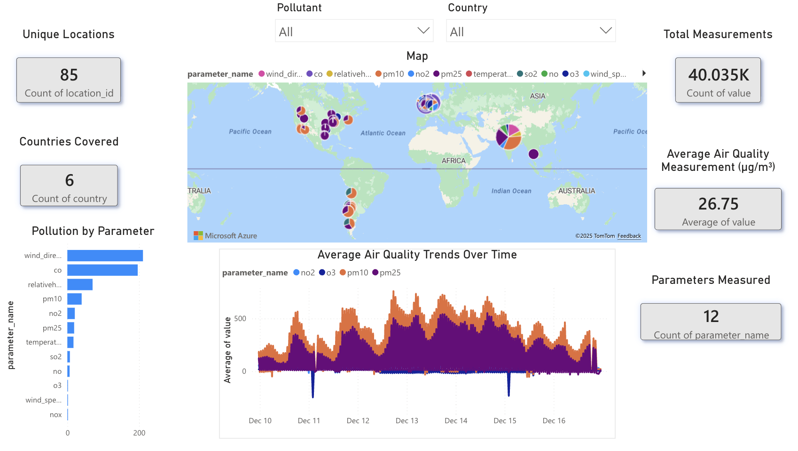

# OpenAQ Air Quality ELT Pipeline

This project implements an end-to-end ELT pipeline for global air quality data using the OpenAQ API. Raw location and hourly measurement data are ingested into BigQuery with Python, orchestrated using Airflow, transformed and tested with dbt, and exposed through an analytics-ready dimensional model. The final dataset is used to power an interactive Power BI dashboard, with example report screenshots available in the `/assets` directory.

## How to Run Locally

### Prerequisites
- Docker and Docker Compose
- A Google Cloud project with BigQuery enabled
- An OpenAQ API key

### Setup
1. Clone the repository.
2. Create a `.env` file at the project root with:
   ```bash
   OPENAQ_API_KEY=your_openaq_api_key
   GOOGLE_APPLICATION_CREDENTIALS=/path/to/your/service_account_key.json
   ```
3. Ensure the BigQuery dataset referenced in the project exists in your GCP project.

### Run the Pipeline
1. Build and start Airflow:
   ```
   docker compose up --build
   ```
2. Open Airflow at `http://localhost:8080` and trigger the `openaq_elt_pipeline` DAG.
3. The DAG will ingest raw data, run dbt transformations, and execute data quality tests.

Transformed tables will be available in BigQuery, and the dashboard visuals can be recreated in Power BI using the analytics tables.


